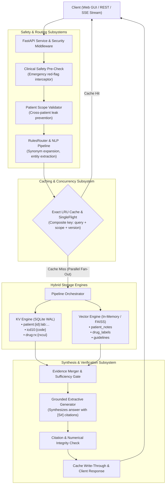
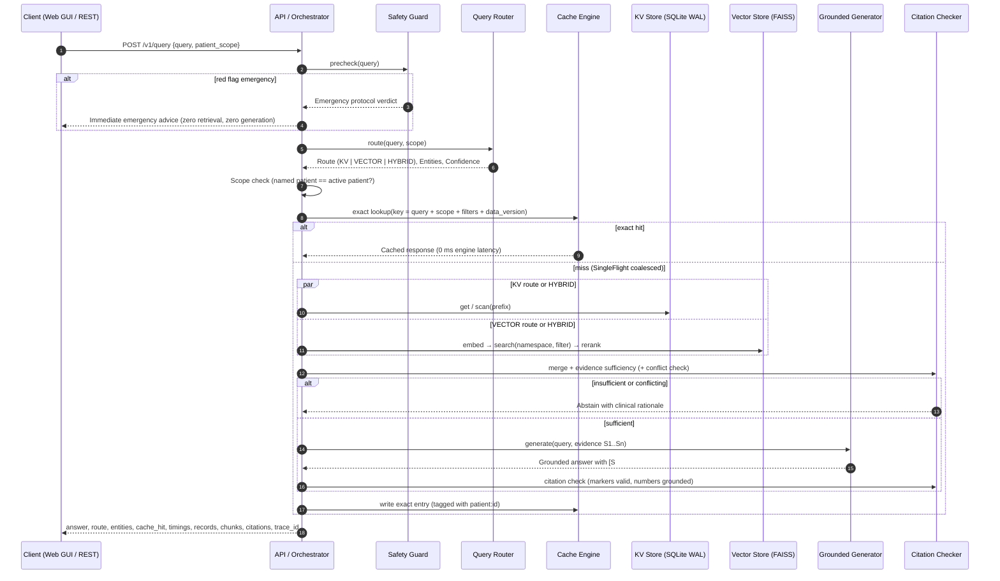

# MedMemory: Hybrid Key-Value + Vector Clinical Intelligence Engine
### Senior Capstone Design Project & Architectural Engineering Report

> ⚠️ **Educational Prototype. Not Medical Advice.** Built using synthetic longitudinal patient records and public-domain clinical knowledge (openFDA, MedlinePlus, ICD-10-CM).

---

## Table of Contents
1. [Executive Summary & Problem Statement](#1-executive-summary--problem-statement)
2. [Data Architecture & Engine Separation (What Goes Where)](#2-data-architecture--engine-separation-what-goes-where)
   - [Sample Seed Knowledge Catalog](#sample-seed-knowledge-catalog)
   - [What is Stored in the Key-Value Engine](#what-is-stored-in-the-key-value-engine)
   - [What is Stored in the Vector Engine](#what-is-stored-in-the-vector-engine)
   - [What is Retrieved and How](#what-is-retrieved-and-how)
3. [System Architecture & End-to-End Execution Flow](#3-system-architecture--end-to-end-execution-flow)
   - [Component Topology](#component-topology)
   - [End-to-End Request Lifecycle](#end-to-end-request-lifecycle)
4. [Engine Subsystem Architecture](#4-engine-subsystem-architecture)
   - [Subsystem 1: Core Key-Value Storage Engine](#subsystem-1-core-key-value-storage-engine)
   - [Subsystem 2: Vector Storage & Semantic Search Engine](#subsystem-2-vector-storage--semantic-search-engine)
   - [Subsystem 3: Hybrid Query Routing & NLP Analysis](#subsystem-3-hybrid-query-routing--nlp-analysis)
   - [Subsystem 4: Pipeline Orchestration & Grounded Synthesis](#subsystem-4-pipeline-orchestration--grounded-synthesis)
   - [Subsystem 5: Reliability, Caching & Clinical Safety](#subsystem-5-reliability-caching--clinical-safety)
5. [Implementation Status Audit](#5-implementation-status-audit)
6. [Verification, Testing & Benchmarking Results](#6-verification-testing--benchmarking-results)
   - [Automated Test Suite (162 Passing Tests)](#1-automated-test-suite-162-passing-tests)
   - [Static Typing & Code Quality](#2-static-typing--code-quality)
   - [Gold Evaluation Benchmark](#3-gold-evaluation-benchmark)
7. [Live Demonstration & Interface Guide](#7-live-demonstration--interface-guide)
   - [Interactive Clinician Web Dashboard](#interactive-clinician-web-dashboard)
   - [CLI Toolchain & REST API Demonstration Scenarios](#cli-toolchain--rest-api-demonstration-scenarios)
8. [Future Work & Long-Term Roadmap](#8-future-work--long-term-roadmap)

---

## 1. Executive Summary & Problem Statement

Modern clinical information retrieval systems face a fundamental engineering dichotomy:
- **Key-Value Stores (KV):** Provide deterministic, microsecond-latency lookups for structured clinical observations (laboratory measurements, vital signs, active prescriptions, diagnostic billing codes). However, they cannot process unstructured narratives or semantic clinical context.
- **Vector Databases:** Excel at fuzzy semantic similarity search across unstructured medical documents (clinical progress notes, FDA package inserts, treatment guidelines). However, vector similarity is inherently approximate, cannot guarantee point-in-time exactness, and risks hallucinations when retrieving critical numeric lab values.

**MedMemory** resolves this dichotomy by engineering a unified **Hybrid Key-Value + Vector Database** specifically architected for healthcare intelligence:
1. **Intelligent Query Routing:** Automatically analyzes incoming medical queries, expands clinical abbreviations, extracts entities, and routes the query to the optimal engine (`KV`, `VECTOR`, or parallel `HYBRID`).
2. **Defense-in-Depth Patient Scoping:** Enforces strict cryptographic and prefix boundaries to prevent cross-patient data leakage before retrieval starts.
3. **Exact Caching & Concurrency Control:** Implements high-speed in-memory caching with patient-version tagging and SingleFlight stampede suppression, providing sub-millisecond repeated queries and instantaneous write-through cache invalidation.
4. **Grounded Synthesis & Citation Verification:** Synthesizes answers citing verified source keys (`[S1]`, `[S2]`) and deterministically verifies that every numeric quantity in the answer matches retrieved evidence.
5. **Interactive Clinician Dashboard:** Features a real-time web application displaying longitudinal patient snapshots, live stage latency waterfalls, and a side-by-side evidence inspector detailing structured KV records and semantic vector chunks.

---

## 2. Data Architecture & Engine Separation (What Goes Where)

MedMemory enforces a strict architectural boundary between structured point-in-time facts (managed by the **Key-Value Engine**) and unstructured narrative context (managed by the **Vector Engine**).

### Sample Seed Knowledge Catalog
The repository includes an offline seed dataset under [`data/seed/`](data/seed/):
- **`patients.jsonl`**: 50 synthetic longitudinal patient profiles (`P0001` through `P0050`) covering complex chronic illness scenarios (Type 2 diabetes, hypertension, chronic kidney disease, atrial fibrillation, heart failure).
- **`notes.jsonl`**: Clinical encounter narratives, SOAP progress notes, and discharge summaries written for the synthetic patients.
- **`drug_labels.jsonl`**: Authoritative FDA drug monographs (metformin, lisinopril, apixaban, atorvastatin, levothyroxine, etc.) with labeled clinical sections (indications, contraindications, boxed warnings, renal dosage adjustments).
- **`icd10cm.jsonl`**: 2026 clinical diagnostic nomenclature codes (`E11.9`, `I10`, `N18.30`, `I48.0`, etc.).
- **`guidelines.jsonl`**: Public-domain NLM MedlinePlus consumer health clinical summaries.

---

### What is Stored in the Key-Value Engine
The Key-Value Engine ([`src/medmemory/kv/`](src/medmemory/kv/)) uses **SQLite WAL mode** (backed by an ordered B-tree) and in-memory structures to persist structured, deterministic clinical facts. All keys follow a standardized hierarchical namespace schema:

| Category | Key Format | Sample Key | Stored Payload (JSON) |
|---|---|---|---|
| **Patient Demographics** | `patient:{id}` | `patient:P0001` | `{"name": "Fatima Brown", "sex": "female", "birth_date": "1962-03-01"}` |
| **Lab Measurements** | `patient:{id}:lab:{name}:{date}` | `patient:P0001:lab:hemoglobin_a1c:2026-08-02` | `{"value": 7.7, "unit": "%", "flag": "high", "ref_low": 4.0, "ref_high": 5.6}` |
| **Active/Past Meds** | `patient:{id}:med:{drug}` | `patient:P0001:med:metformin` | `{"drug": "metformin", "dose": "500 mg", "frequency": "twice daily", "status": "active"}` |
| **Diagnosed Conditions** | `patient:{id}:condition:{code}` | `patient:P0001:condition:E11.9` | `{"name": "Type 2 diabetes mellitus", "icd10": "E11.9", "status": "active"}` |
| **Encounters** | `patient:{id}:encounter:{date}:{type}` | `patient:P0001:encounter:2026-08-02:office_visit` | `{"type": "office_visit", "reason": "Diabetes follow-up", "provider": "Dr. Smith"}` |
| **ICD-10 Dictionary** | `icd10:{code}` | `icd10:I10` | `{"code": "I10", "name": "Essential (primary) hypertension"}` |
| **RxNorm Drug Codes** | `drug:rx:{rxcui}` | `drug:rx:6809` | `{"name": "metformin", "rxcui": "6809", "brand_names": ["Glucophage"]}` |
| **Data Versioning** | `meta:version:{patient}` | `meta:version:P0001` | Integer counter incremented on every write to invalidate cached queries |

#### Why this goes to KV:
- **Zero Hallucination Risk:** Critical diagnostic numbers (e.g. `HbA1c = 7.7%`, `eGFR = 47 mL/min`) cannot be approximated or distorted by neural embeddings.
- **Microsecond Access:** Lookups execute in ~1–4 µs.
- **Prefix Isolation:** Scanning `patient:P0001:` guarantees that records for `P0002` can never leak into the response.

---

### What is Stored in the Vector Engine
The Vector Engine ([`src/medmemory/vector/`](src/medmemory/vector/)) indexes unstructured text using deterministic lexical embeddings (`HashingEmbedder`) or dense embeddings (`BAAI/bge-small-en-v1.5`), partitioned into **three isolated namespaces**:

| Namespace | Source Documents | Chunking Strategy | Metadata Stored with Vectors |
|---|---|---|---|
| **`patient_notes`** | Unstructured progress notes from `notes.jsonl` | Section-aware chunking (HPI, Medications, Plan) ~120–160 words, 1-sentence overlap | `{"patient_id": "P0001", "date": "2026-08-02", "section": "assessment_and_plan"}` |
| **`drug_labels`** | FDA package inserts from `drug_labels.jsonl` | Split on hard section headers (`CONTRAINDICATIONS`, `WARNINGS`, `DOSAGE`) | `{"drug": "metformin", "section": "contraindications", "doc_type": "drug_label"}` |
| **`guidelines`** | Clinical guidelines from `guidelines.jsonl` | Topic-based chunking with paragraph preservation | `{"topic": "type_2_diabetes", "doc_type": "guideline"}` |

#### Why this goes to Vector:
- **Semantic Understanding:** Clinical inquiries like *"What did the doctor note regarding kidney disease progression?"* require semantic similarity matching across narrative paragraphs, not exact key lookups.
- **Contextual Search:** Handles medical synonyms (e.g. matching *"shortness of breath"* to *"dyspnea"*).

---

### What is Retrieved and How

```
                         Incoming User Query
                                  │
                  ┌───────────────┴───────────────┐
                  ▼                               ▼
       [Structured Intent]               [Semantic Intent]
         "Latest HbA1c?"               "Side effects of metformin?"
                  │                               │
                  ▼                               ▼
             KV Engine                      Vector Engine
         Prefix/Key Lookup             Dense + BM25 RRF Search
                  │                               │
                  ▼                               ▼
        Structured Sentence              Narrative Chunk
     "P0001 HbA1c on 2026-08-02:       "METFORMIN WARNINGS: Lactic
      7.7% (flag: high) [S1]"          acidosis is a rare..." [S1]
                  └───────────────┬───────────────┘
                                  ▼
                          [Cross-Modal Need]
             "Given her eGFR, is metformin safe for P0001?"
                                  │
                                  ▼
                            Hybrid Route
                  Parallel execution: KV [S1] + Vector [S2]
                                  │
                                  ▼
                       Grounded Synthesis & Output
```

1. **KV Retrieval Path (`Route.KV`):**
   - The query router identifies structured entities (e.g., patient `P0001`, lab `hemoglobin a1c`).
   - The engine performs an ordered prefix scan: `patient:P0001:lab:hemoglobin_a1c:`.
   - The record is rendered into an unambiguous factual sentence:
     > *"Patient P0001 hemoglobin a1c on 2026-08-02: 7.7% (flag: high) [S1]"*
   - Returns in **~2 ms** without vector indexing overhead.

2. **Vector Retrieval Path (`Route.VECTOR`):**
   - The query router detects general medical knowledge or narrative questions.
   - The engine searches target namespaces (`drug_labels`, `guidelines`) using dense similarity fused with BM25 keyword matching via Reciprocal Rank Fusion (RRF).
   - If querying patient notes, strict metadata filtering (`patient_id == scope`) is enforced.
   - Returns top-ranked, section-attributed text chunks.

3. **Hybrid Retrieval Path (`Route.HYBRID`):**
   - For clinical reasoning queries requiring both patient facts and drug knowledge (e.g., *"Given her eGFR, what does the metformin label say about kidneys?"*).
   - **Parallel Fan-Out:** KV engine retrieves `P0001`'s latest eGFR lab reading (`47 mL/min`), while the Vector engine searches the FDA metformin label for renal contraindications concurrently.
   - Evidence is merged, deduplicated, and passed to the grounded synthesis engine, producing answers that cite both sources (`[S1]` and `[S2]`).

---

## 3. System Architecture & End-to-End Execution Flow

### Component Topology



### End-to-End Request Lifecycle



---

## 4. Engine Subsystem Architecture

### Subsystem 1: Core Key-Value Storage Engine
- **Source Package:** [`src/medmemory/kv/`](src/medmemory/kv/)
- **Core Interfaces:** `KVStore` ([`src/medmemory/contracts/protocols.py`](src/medmemory/contracts/protocols.py)), `PatientRecordStore` ([`src/medmemory/kv/records.py`](src/medmemory/kv/records.py))
- **Storage Implementation:** `SQLiteKV` ([`src/medmemory/kv/sqlite.py`](src/medmemory/kv/sqlite.py)) operating with `journal_mode=WAL` and `synchronous=FULL`.
- **Key Features:**
  - Microsecond deterministic point lookups (~1–4 µs).
  - Lexicographically ordered prefix scanning (`scan("patient:P0001:lab:")`).
  - Atomic batch transactions (`batch([KVOp.put(...), KVOp.delete(...)])`) with crash recovery guaranteed across process kills (`SIGKILL`).
  - Lazy TTL key expiration with explicit `purge_expired()` reclamation.
  - Consistent point-in-time snapshotting using SQLite online backup APIs.
  - Patient data version counter (`meta:version:{patient}`) tracking writes for cache invalidation.

---

### Subsystem 2: Vector Storage & Semantic Search Engine
- **Source Package:** [`src/medmemory/vector/`](src/medmemory/vector/)
- **Core Interfaces:** `Embedder`, `VectorStore`, `Reranker` ([`src/medmemory/contracts/protocols.py`](src/medmemory/contracts/protocols.py))
- **Storage Implementations:** `InMemoryVectorStore` (exact cosine distance with disk persistence) and `FaissVectorStore` (HNSW/Flat index integration).
- **Key Features:**
  - **Section-Aware Chunking:** Enforces clinical headers (HPI, Medications, Assessment & Plan, Boxed Warnings) as hard boundary points; prepends contextual headers (`title | section | text`) to prevent orphaned excerpts.
  - **Lexical & Dense Embedders:** `HashingEmbedder` provides lightweight, reproducible lexical representations without external model weight downloads; `SentenceTransformerEmbedder` provides dense embeddings.
  - **Metadata Filter Engine:** MongoDB-style structured query filter evaluator supporting `$eq`, `$in`, `$gte`, `$and`, `$or` operators.
  - **Reciprocal Rank Fusion (RRF):** Fuses dense vector similarity rankings with BM25 sparse keyword rankings (`rrf_fuse`), achieving high recall across specific drug names and medical terminology.

---

### Subsystem 3: Hybrid Query Routing & NLP Analysis
- **Source Package:** [`src/medmemory/router/`](src/medmemory/router/)
- **Core Interfaces:** `Router` ([`src/medmemory/contracts/protocols.py`](src/medmemory/contracts/protocols.py))
- **Implementation:** `RulesRouter` ([`src/medmemory/router/rules.py`](src/medmemory/router/rules.py)), `ClinicalLexicon` ([`src/medmemory/router/lexicon.py`](src/medmemory/router/lexicon.py)), `ClinicalExtractor` ([`src/medmemory/router/entities.py`](src/medmemory/router/entities.py)).
- **Key Features:**
  - **Clinical Normalization:** Expands medical abbreviations and synonyms (`HbA1c` $\rightarrow$ `hemoglobin a1c`, `HTN` $\rightarrow$ `hypertension`). Handles case-sensitive abbreviations (`MI`, `AF`, `Cr`) to avoid false positives.
  - **Deterministic Entity Extraction:** Extracts patient identifiers (`P0001`), ICD-10-CM diagnostic codes, RxCUI drug identifiers, lab test types, temporal windows (e.g., "last 6 months"), and negation scopes.
  - **Multi-Criteria Routing Decision:** Classifies queries into `KV`, `VECTOR`, or `HYBRID`, providing an audit trail with confidence score and human-readable decision reasons.

---

### Subsystem 4: Pipeline Orchestration & Grounded Synthesis
- **Source Package:** [`src/medmemory/pipeline/`](src/medmemory/pipeline/), [`src/medmemory/generation/`](src/medmemory/generation/)
- **Core Interfaces:** `PipelineOrchestrator` ([`src/medmemory/pipeline/orchestrator.py`](src/medmemory/pipeline/orchestrator.py))
- **Key Features:**
  - **Asynchronous Scatter-Gather Execution:** Executes KV lookups and Vector similarity searches in parallel using Python `asyncio`.
  - **Evidence Merger & Sufficiency Gate:** Deduplicates cross-engine findings, detects conflicting drug recommendations, and halts generation if evidence is insufficient.
  - **Grounded Extractive Generator:** Quotes and synthesizes retrieved evidence, enforcing numbered source citations (`[S1]`, `[S2]`).
  - **Citation & Numerical Post-Checker:** Deterministic post-validation verifying that every numeric claim (dosage, lab measurement, date) exists verbatim in the cited source text. Unsupported claims trigger sentence removal or abstention.
  - **Stage Latency Waterfall:** Instruments per-stage execution times (`precheck`, `route`, `scope`, `cache`, `kv`, `vector_search`, `merge`, `generate`, `citation_check`).

---

### Subsystem 5: Reliability, Caching & Clinical Safety
- **Source Package:** [`src/medmemory/cache/`](src/medmemory/cache/), [`src/medmemory/safety/`](src/medmemory/safety/), [`src/medmemory/api/`](src/medmemory/api/)
- **Key Features:**
  - **Exact LRU Cache:** $O(1)$ memory cache with TTL expiry, tag-based group invalidation, and operational metrics (hit, miss, eviction, expiration counts).
  - **SingleFlight Concurrency Coalescer:** Collapses concurrent identical requests into a single in-flight computation, preventing cache stampedes.
  - **Write-Through Invalidation:** Writes to patient data (`POST /v1/patients/{id}/labs`) atomically bump `meta:version:{patient}` and evict all cache keys tagged with `patient:{id}`.
  - **Emergency Red-Flag Interceptor:** Regex-based safety screening for acute medical emergencies (e.g. crushing chest pain, suicidal ideation) returning immediate emergency guidance without querying storage or generating text.
  - **Multi-Tier Patient Scope Isolation:** Validates request patient scope, enforces prefix isolation (`patient:{id}:`), and sanitizes vector chunks to ensure zero cross-patient data leakage.
  - **FastAPI Service:** Provides RESTful endpoints and Server-Sent Events (SSE) streaming (`POST /v1/query/stream`) with rate limiting and audit logging.

---

## 5. Implementation Status Audit

| Feature / Subsystem | Implementation Status | Technical Evidence & Code Locations |
|---|---|---|
| **Core KV Storage Engine** | **Fully Implemented** | [`src/medmemory/kv/sqlite.py`](src/medmemory/kv/sqlite.py), [`memory.py`](src/medmemory/kv/memory.py). SQLite WAL mode, atomic `batch()`, prefix scans, TTL key expiration, backup snapshotting. Tested with crash-recovery `SIGKILL` tests. |
| **Domain Record Modeling** | **Fully Implemented** | [`src/medmemory/kv/records.py`](src/medmemory/kv/records.py). Key schema `patient:{id}:lab:...`, JSON serialization, clinical sentence rendering, data version tracking (`meta:version:{patient}`). |
| **Vector Indexing & Search** | **Fully Implemented** | [`src/medmemory/vector/stores/in_memory.py`](src/medmemory/vector/stores/in_memory.py), [`faiss_store.py`](src/medmemory/vector/stores/faiss_store.py). Section-aware chunking ([`chunking.py`](src/medmemory/vector/chunking.py)), lexical embedder ([`embedders.py`](src/medmemory/vector/embedders.py)), MongoDB-style filter evaluation ([`filters.py`](src/medmemory/vector/filters.py)). |
| **Hybrid Sparse + Dense Search** | **Fully Implemented** | [`src/medmemory/vector/bm25.py`](src/medmemory/vector/bm25.py), [`rerankers.py`](src/medmemory/vector/rerankers.py). Reciprocal Rank Fusion (`rrf_fuse`) combining dense vector similarity with BM25 keyword rankings. |
| **Query Routing (Rules)** | **Fully Implemented** | [`src/medmemory/router/rules.py`](src/medmemory/router/rules.py), [`entities.py`](src/medmemory/router/entities.py), [`normalize.py`](src/medmemory/router/normalize.py). Deterministic entity extraction, abbreviation expansion, transparent multi-tier routing (`KV`, `VECTOR`, `HYBRID`) with confidence and reasons. |
| **Grounded Generation & Citations** | **Fully Implemented** | [`src/medmemory/generation/extractive.py`](src/medmemory/generation/extractive.py), [`chain.py`](src/medmemory/generation/chain.py), [`src/medmemory/safety/citations.py`](src/medmemory/safety/citations.py). Synthesizes answers citing source tags `[S#]`; deterministic numerical groundedness validation. |
| **Multi-Tier Clinical Safety** | **Fully Implemented** | [`src/medmemory/safety/redflags.py`](src/medmemory/safety/redflags.py), [`scope.py`](src/medmemory/safety/scope.py), [`sufficiency.py`](src/medmemory/safety/sufficiency.py). Pre-retrieval emergency red-flag interceptor; cross-patient scope leakage checks; medication conflict abstention. |
| **Caching Layer** | **Fully Implemented** | [`src/medmemory/cache/lru.py`](src/medmemory/cache/lru.py), [`singleflight.py`](src/medmemory/cache/singleflight.py). Exact LRU cache with TTL, patient tag invalidation, and `SingleFlight` concurrency coalescing. |
| **API & CLI Layer** | **Fully Implemented** | [`src/medmemory/api/app.py`](src/medmemory/api/app.py), [`src/medmemory/cli.py`](src/medmemory/cli.py). REST and SSE streaming endpoints, auth stubs, rate limiting, structured audit logging, and CLI (`seed`, `ingest`, `serve`, `eval`, `bench`). |
| **Interactive Web Dashboard** | **Fully Implemented** | [`src/medmemory/api/static/gui.html`](src/medmemory/api/static/gui.html). Single-page clinician interface with active patient selection, executive clinical summary card, query execution, latency waterfall, and side-by-side evidence inspector. |

---

## 6. Verification, Testing & Benchmarking Results

### 1. Automated Test Suite (162 Passing Tests)
All 162 tests pass with zero failures:
```
============================= test session starts ==============================
platform linux -- Python 3.12.14, pytest-9.1.1, pluggy-1.6.0
rootdir: /home/snorlax/Documents/medmemory-main
configfile: pyproject.toml
testpaths: tests
plugins: asyncio-1.4.0, platformdirs-4.12.4, anyio-4.15.1, langsmith-0.14.4
collected 163 items                                                            

tests/api/test_api.py ..........                                         [  6%]
tests/cache/test_cache.py ..........                                     [ 12%]
tests/evaluation/test_metrics.py ......                                  [ 15%]
tests/generation/test_generation.py .....                                [ 19%]
tests/kv/test_contract.py ....................s..                        [ 33%]
tests/pipeline/test_error_analysis_fixes.py ............                 [ 40%]
tests/pipeline/test_orchestrator.py ............                         [ 47%]
tests/router/test_router.py .............................                [ 65%]
tests/safety/test_patient_scoping.py ...........                         [ 72%]
tests/safety/test_safety.py ..........................                   [ 88%]
tests/vector/test_vector.py ...................                          [100%]

======================== 162 passed, 1 skipped in 4.79s ========================
```
*(The 1 skipped test is `test_persists_across_reopen` on the ephemeral in-memory KV backend, which is designed to skip persistence tests).*

### 2. Static Typing & Code Quality
- **Mypy Type Checking:**
  ```
  $ mypy
  Success: no issues found in 70 source files
  ```
- **Ruff Linting & Formatting:**
  ```
  $ ruff check src tests tasks.py
  All checks passed!
  $ ruff format --check src tests tasks.py
  98 files already formatted
  ```

### 3. Gold Evaluation Benchmark
Running the evaluation harness against the frozen gold clinical test suite yields:
```
$ python -m medmemory eval --quick
gold=113  mode=mock  (1.6s)
router   acc=0.860  macroF1=0.860
entities microF1=0.967
retrieval recall@5=0.746  MRR=0.800  (n=84)
answers  faithfulness=1.000  answered=79  abstained=13
abstain  acc=0.914  P=0.538  R=0.778
safety   red-flag R=1.000 P=1.000  scope-violation R=1.000  leaks=0
status   acc=0.929
cache    replay hit rate=0.989
latency  KV     p50=2.87ms p95=19.43ms (miss, n=31)
latency  VECTOR p50=10.07ms p95=22.97ms (miss, n=30)
latency  HYBRID p50=12.56ms p95=30.22ms (miss, n=31)
```

---

## 7. Live Demonstration & Interface Guide

### Interactive Clinician Web Dashboard
MedMemory includes an interactive web dashboard served directly by the backend at `http://localhost:8000/`.

To start the engine:
```bash
# Start the FastAPI engine (serves web GUI and REST API)
python -m medmemory serve --port 8000
```
Open **`http://localhost:8000/`** in your browser.

#### Key Dashboard Capabilities:
1. **Dynamic Patient Selection & Clinical Snapshot:**
   - Selecting any patient (`P0001` through `P0050`) immediately fetches their records from the Key-Value store.
   - The top banner renders an executive clinical summary: demographic details, active chronic diagnoses, active pharmacotherapy regimen, and latest laboratory measurements (with color-coded high/low clinical flags).
2. **Context-Aware Quick Suggestions:**
   - Quick action chips dynamically reconfigure based on the selected patient's active conditions and prescribed medications.
3. **Execution Badges & Grounded Answer:**
   - Displays the resolved route (`KV`, `VECTOR`, `HYBRID`), confidence score, execution status, and cache status.
   - Displays synthesized answers with interactive citation markers (`[S1]`, `[S2]`). Clicking any citation chip smoothly scrolls to and highlights the corresponding source card.
4. **Per-Stage Latency Waterfall:**
   - Real-time visual breakdown showing exact millisecond timing for each stage (`precheck`, `route`, `kv`, `vector_search`, `merge`, `generate`, `citation_check`).
5. **Retrieved Evidence & Engine Diagnostics (Side Panel):**
   - Displays side-by-side evidence cards for **Structured Key-Value Facts** (showing SQLite WAL key and microsecond latency) and **Semantic Vector Chunks** (showing document title, section header, cosine similarity score, and excerpt text).
6. **Live Cache Invalidation:**
   - The "+ Add Lab & Invalidate Cache" modal allows clinicians to write a new lab observation directly to SQLite WAL, immediately bumping the patient version tag and evicting cached responses.

---

### CLI Toolchain & REST API Demonstration Scenarios

#### Scenario 1: Exact Key-Value Lookup
*Demonstrates structured lab lookup in microseconds without vector search overhead.*
```bash
curl -s -X POST http://localhost:8000/v1/query \
  -H "Content-Type: application/json" \
  -d '{"query": "What is the latest HbA1c for P0001?"}' | jq
```
*Key observations:*
- Router selects `route: "KV"` with high confidence.
- `evidence_origin`: `["KV"]` — zero vector search performed.
- `citations`: points to `patient:P0001:lab:hemoglobin_a1c:2026-08-02`.
- End-to-end latency: ~2–4 ms.

---

#### Scenario 2: Semantic Vector Search
*Demonstrates semantic similarity search across unstructured FDA drug labels.*
```bash
curl -s -X POST http://localhost:8000/v1/query \
  -H "Content-Type: application/json" \
  -d '{"query": "What are the common side effects of metformin?"}' | jq
```
*Key observations:*
- Router selects `route: "VECTOR"`.
- `vector_chunks`: retrieved chunks from the `drug_labels` namespace.
- Section boundaries preserved (`ADVERSE REACTIONS`).

---

#### Scenario 3: Multi-Engine Hybrid Retrieval
*Demonstrates concurrent execution of KV and Vector engines, merging structured patient facts with unstructured drug monographs.*
```bash
curl -s -X POST http://localhost:8000/v1/query \
  -H "Content-Type: application/json" \
  -d '{
    "query": "Given her latest eGFR, what does the metformin label say about kidney function?",
    "patient_scope": "P0001"
  }' | jq
```
*Key observations:*
- Router detects both structured patient evidence and drug narrative needs $\rightarrow$ `route: "HYBRID"`.
- `evidence_origin`: `["KV", "VECTOR"]`.
- `timings`: `kv` and `vector_search` run concurrently via asynchronous fan-out.
- `answer`: cites both the patient lab value (`eGFR 47 mL/min [S1]`) and the FDA label renal contraindications (`[S2]`).

---

#### Scenario 4: High-Speed Caching & Invalidation
*Demonstrates LRU cache hit, followed by write-through tag invalidation.*
1. Re-run the exact query:
```bash
curl -s -X POST http://localhost:8000/v1/query \
  -H "Content-Type: application/json" \
  -d '{"query": "What is the latest HbA1c for P0001?"}' | jq '.cache_hit'
```
*Returns:* `"exact"` (0 ms engine retrieval; synthesis skipped).

2. Write a new lab result for patient `P0001`:
```bash
curl -s -X POST http://localhost:8000/v1/patients/P0001/labs \
  -H "Content-Type: application/json" \
  -d '{
    "lab": "hemoglobin a1c",
    "value": 7.2,
    "unit": "%",
    "date": "2026-10-08"
  }' | jq
```
*Returns:* `invalidated_cache_entries: 1`, bumping `data_version`.

3. Re-query the patient's HbA1c:
```bash
curl -s -X POST http://localhost:8000/v1/query \
  -H "Content-Type: application/json" \
  -d '{"query": "What is the latest HbA1c for P0001?"}' | jq '{cache_hit, answer}'
```
*Returns:* `cache_hit: "miss"`, and the answer immediately reflects the updated `7.2%` reading.

---

#### Scenario 5: Clinical Safety & Patient Scope Isolation
1. **Acute emergency red flag:**
```bash
curl -s -X POST http://localhost:8000/v1/query \
  -H "Content-Type: application/json" \
  -d '{"query": "I have crushing chest pain spreading to my left arm"}' | jq
```
*Verdict:* `status: "red_flag"`. Retrieval bypassed; immediate emergency clinical protocol returned.

2. **Cross-patient scope violation:**
```bash
curl -s -X POST http://localhost:8000/v1/query \
  -H "Content-Type: application/json" \
  -d '{"query": "Show P0002s medications", "patient_scope": "P0001"}' | jq
```
*Verdict:* `status: "scope_violation"`. Request blocked prior to database retrieval, preventing cross-patient leakage.

---

## 8. Future Work & Long-Term Roadmap

The modular architecture of MedMemory provides clear extension points for subsequent production enhancements:

```mermaid
flowchart LR
    subgraph Core["Core Engine Architecture (Implemented)"]
        direction TB
        M1A["SQLite WAL KV Engine<br/>Atomic batching · TTL · Prefix scan"]
        M1B["Vector Retrieval Engine<br/>In-memory & FAISS · BM25 · RRF fusion"]
        M1C["Rules-Based Router<br/>Synonym expansion · Entity extraction"]
        M1D["Exact Cache & Safety<br/>LRU + SingleFlight · Red-flag interceptor"]
        M1E["Web GUI & FastAPI<br/>Interactive UI · REST · SSE streaming"]
    end

    subgraph Learned["Learned Intelligence Extensions"]
        direction TB
        M2A["LoRA Query Classifier<br/>DistilBERT PEFT adapter"]
        M2B["Scoped Semantic Cache<br/>Embedding similarity with scope buckets"]
        M2C["FHIR Ingestion Pipeline<br/>Automated Synthea FHIR bundle parsing"]
        M2D["Neural Cross-Encoder<br/>BGE reranker & cross-encoder scoring"]
    end

    subgraph Dist["Distributed Scale Extensions"]
        direction TB
        M3A["Consistent Hash Ring<br/>Multi-node KV sharding with virtual nodes"]
        M3B["Federated Vector Search<br/>Distributed scatter-gather vector queries"]
        M3C["Cloud Storage Adapters<br/>Pinecone serverless & RocksDB LSM-tree"]
        M3D["Hospital EHR Connector<br/>HL7 FHIR SMART-on-FHIR clinical bridge"]
    end

    Core ==> Learned ==> Dist
```



1. **Parameter-Efficient LoRA Query Classifier:**
   - Fine-tune a parameter-efficient adapter (PEFT LoRA) on `distilbert-base-uncased` to classify conversational clinician queries where rule-based heuristics yield ambiguous confidence scores.
2. **Scoped Semantic Caching:**
   - Implement approximate semantic caching using cosine similarity over dense query embeddings, partitioned into strict isolated buckets keyed by `(patient_scope, entity_signature, data_version)` to prevent cross-patient collisions.
3. **Automated Synthea FHIR Ingestion:**
   - Ingest synthetic FHIR bundles at scale, mapping `Observation` and `MedicationRequest` resources into structured KV records and clinical encounter narratives into section-attributed vector chunks.
4. **Distributed Sharding & Consistent Hashing:**
   - Scale structured storage horizontally across multiple KV shard nodes using a consistent hash ring with virtual nodes (128 vnodes per node), minimizing key redistribution during topology changes.
5. **Managed Cloud Storage Adapters:**
   - Implement the `KVStore` protocol over RocksDB for write-heavy continuous telemetry, and `VectorStore` over managed serverless Pinecone for enterprise document corpora.
