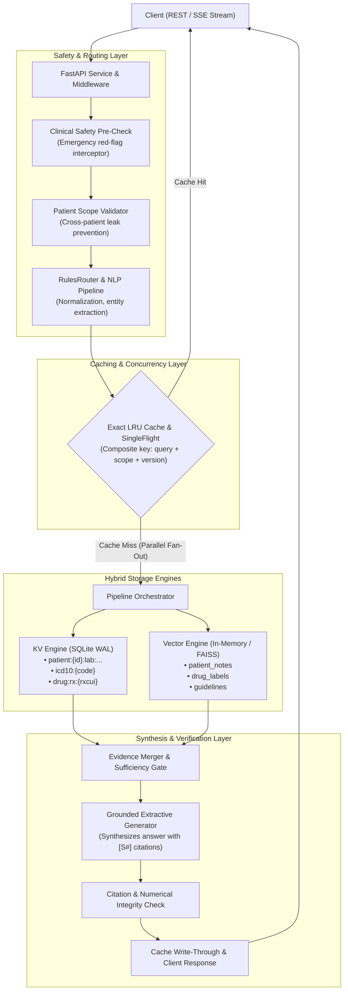
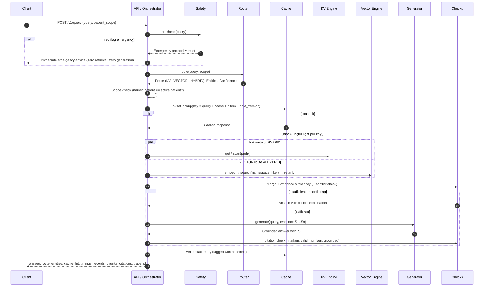

# MedMemory: Hybrid Key-Value + Vector Database
### Phase 1 Presentation Milestone (~40–50%) — Architectural & Engineering Report

> ⚠️ **Educational Prototype. Not Medical Advice.** Uses synthetic patient records and public-domain clinical knowledge (openFDA, MedlinePlus, ICD-10-CM).

---

## Table of Contents
1. [Data Architecture & Engine Separation (What Goes Where)](#1-data-architecture--engine-separation-what-goes-where)
   - [Sample Seed Data Catalog](#sample-seed-data-catalog)
   - [What is Stored in the Key-Value Engine](#what-is-stored-in-the-key-value-engine)
   - [What is Stored in the Vector Engine](#what-is-stored-in-the-vector-engine)
   - [What is Retrieved and How](#what-is-retrieved-and-how)
2. [Architectural Report](#2-architectural-report)
   - [System Overview & Problem Statement](#system-overview--problem-statement)
   - [Component Architecture & Interactions](#component-architecture--interactions)
   - [End-to-End Execution & Data Flow](#end-to-end-execution--data-flow)
   - [Project Maturity Assessment](#project-maturity-assessment)
3. [Implementation Status Audit Table](#3-implementation-status-audit-table)
4. [Five-Person Work Division (Current Milestone Only)](#4-five-person-work-division-current-milestone-only)
5. [Verification Results](#5-verification-results)
6. [Presentation & Live Demonstration Guide](#6-presentation--live-demonstration-guide)
   - [Preparation & Server Startup](#preparation--server-startup)
   - [Step-by-Step Live Demo Flow (3–4 minutes)](#step-by-step-live-demo-flow-34-minutes)
7. [Cleanup & Milestone Decoupling Summary](#7-cleanup--milestone-decoupling-summary)
8. [Future Work Specification & Extended Roadmap](#8-future-work-specification--extended-roadmap)
   - [Evolution Roadmap Flowchart](#evolution-roadmap-flowchart)
   - [Phase 2: Learned Intelligence & Semantic Acceleration](#phase-2-learned-intelligence--semantic-acceleration)
   - [Phase 3: Distributed Architecture & Cloud Scale](#phase-3-distributed-architecture--cloud-scale)

---

## 1. Data Architecture & Engine Separation (What Goes Where)

MedMemory enforces a strict architectural boundary between structured point-in-time facts (managed by the **Key-Value Engine**) and unstructured narrative context (managed by the **Vector Engine**).

### Sample Seed Data Catalog
The repository includes an offline seed dataset under [`data/seed/`](data/seed/):
- **`patients.jsonl`**: 10 synthetic longitudinal patient profiles (`P0001` through `P0010`) covering chronic illness scenarios (Type 2 diabetes, hypertension, chronic kidney disease, atrial fibrillation, heart failure).
- **`notes.jsonl`**: Clinical encounter narratives, SOAP progress notes, and discharge summaries written for the synthetic patients.
- **`drug_labels.jsonl`**: Authoritative FDA drug monographs (metformin, lisinopril, apixaban, atorvastatin, levothyroxine, etc.) with labeled clinical sections (indications, contraindications, boxed warnings, renal dosage adjustments).
- **`icd10cm.jsonl`**: 2026 clinical diagnostic nomenclature codes (`E11.9`, `I10`, `N18.30`, `I48.0`, etc.).
- **`guidelines.jsonl`**: Public-domain NLM MedlinePlus consumer health clinical summaries.

---

### What is Stored in the Key-Value Engine
The Key-Value Engine ([`src/medmemory/kv/`](src/medmemory/kv/)) uses **SQLite WAL mode** (backed by an ordered B-tree) and in-memory structures to persist structured, deterministic clinical facts. All keys follow a standardized hierarchical namespace schema:

| Category | Key Format | Sample Key | Stored Payload (JSON) |
|---|---|---|---|
| **Patient Demographics** | `patient:{id}` | `patient:P0001` | `{"name": "Eleanor Vance", "sex": "F", "birth_date": "1958-04-12"}` |
| **Lab Measurements** | `patient:{id}:lab:{name}:{date}` | `patient:P0001:lab:hemoglobin_a1c:2026-08-02` | `{"value": 6.4, "unit": "%", "flag": "normal", "ref_low": 4.0, "ref_high": 5.6}` |
| **Active/Past Meds** | `patient:{id}:med:{status}:{drug}` | `patient:P0001:med:active:metformin` | `{"drug": "metformin", "dose": "500 mg", "frequency": "BID", "indication": "T2DM", "start": "2021-03-10"}` |
| **Diagnosed Conditions** | `patient:{id}:condition:{status}:{code}` | `patient:P0001:condition:active:E11.9` | `{"name": "Type 2 diabetes", "icd10": "E11.9", "onset": "2021-03-01"}` |
| **Documented Allergies** | `patient:{id}:allergy:{substance}` | `patient:P0001:allergy:penicillin` | `{"substance": "penicillin", "reaction": "rash", "severity": "moderate"}` |
| **Encounters** | `patient:{id}:encounter:{date}:{type}` | `patient:P0001:encounter:2026-08-02:office_visit` | `{"type": "office_visit", "reason": "Diabetes follow-up", "provider": "Dr. Smith"}` |
| **ICD-10 Dictionary** | `icd10:{code}` | `icd10:I10` | `{"code": "I10", "name": "Essential (primary) hypertension"}` |
| **RxNorm Drug Codes** | `drug:rx:{rxcui}` | `drug:rx:6809` | `{"name": "metformin", "rxcui": "6809", "brand_names": ["Glucophage"]}` |
| **Data Versioning** | `meta:version:{patient}` | `meta:version:P0001` | Integer counter bumped on every write to invalidate cached queries |

#### Why this goes to KV:
- **Zero Hallucination:** Exact numbers (e.g. `HbA1c = 6.4%`, `eGFR = 48 mL/min`) cannot be approximated or distorted.
- **Microsecond Access:** Lookups take ~1–4 µs.
- **Prefix Isolation:** Scanning `patient:P0001:` guarantees that data for `P0002` can never leak into the response.

---

### What is Stored in the Vector Engine
The Vector Engine ([`src/medmemory/vector/`](src/medmemory/vector/)) indexes unstructured text using deterministic lexical embeddings (`HashingEmbedder`) or dense embeddings (`BAAI/bge-small-en-v1.5`), partitioned into **three isolated namespaces**:

| Namespace | Source Documents | Chunking Strategy | Metadata Stored with Vectors |
|---|---|---|---|
| **`patient_notes`** | Unstructured progress notes from `notes.jsonl` | Section-aware chunking (HPI, Medications, Plan) ~120–160 words, 1-sentence overlap | `{"patient_id": "P0001", "date": "2026-08-02", "section": "assessment_and_plan"}` |
| **`drug_labels`** | FDA package inserts from `drug_labels.jsonl` | Split on hard section headers (`CONTRAINDICATIONS`, `WARNINGS`, `DOSAGE`) | `{"drug": "metformin", "section": "contraindications", "doc_type": "drug_label"}` |
| **`guidelines`** | Clinical guidelines from `guidelines.jsonl` | Topic-based chunking with paragraph preservation | `{"topic": "type_2_diabetes", "doc_type": "guideline"}` |

#### Why this goes to Vector:
- **Semantic Understanding:** Clinical questions like *"What did the doctor note regarding ankle swelling?"* require semantic similarity matching across narrative paragraphs, not exact key lookups.
- **Contextual Search:** Allows matching synonyms (e.g. *"shortness of breath"* matching *"dyspnea"*).

---

### What is Retrieved and How

```
                         Incoming User Query
                                  │
                  ┌───────────────┴───────────────┐
                  ▼                               ▼
       [Structured Intent]               [Semantic Intent]
         "Latest HbA1c?"               "Side effects of metformin?"
                  │                               │
                  ▼                               ▼
             KV Engine                      Vector Engine
         Prefix/Key Lookup             Dense + BM25 RRF Search
                  │                               │
                  ▼                               ▼
        Structured Sentence              Narrative Chunk
     "P0001 HbA1c on 2026-08-02:      "METFORMIN WARNINGS: Lactic
      6.4% (flag: normal) [S1]"        acidosis is a rare..." [S1]
                  └───────────────┬───────────────┘
                                  ▼
                          [Cross-Modal Need]
             "Given her eGFR, is metformin safe for P0001?"
                                  │
                                  ▼
                            Hybrid Route
                  Parallel execution: KV [S1] + Vector [S2]
                                  │
                                  ▼
                       Grounded Synthesis & Output
```

1. **KV Retrieval Path (`Route.KV`):**
   - The query router identifies structured entities (e.g., patient `P0001`, lab `hemoglobin a1c`).
   - The engine performs an ordered prefix scan: `patient:P0001:lab:hemoglobin_a1c:`.
   - The record is rendered into an unambiguous factual sentence:
     > *"Patient P0001 hemoglobin a1c on 2026-08-02: 6.4% (flag: normal)."*
   - Returns in **~2 ms** without vector indexing overhead.

2. **Vector Retrieval Path (`Route.VECTOR`):**
   - The query router detects general medical knowledge or narrative questions.
   - The engine searches target namespaces (`drug_labels`, `guidelines`) using dense similarity fused with BM25 keyword matching via Reciprocal Rank Fusion (RRF).
   - If querying patient notes, strict metadata filtering (`patient_id == scope`) is enforced.
   - Returns top-ranked, section-attributed text chunks.

3. **Hybrid Retrieval Path (`Route.HYBRID`):**
   - For clinical reasoning queries requiring both patient facts and drug knowledge (e.g., *"Given her eGFR, what does the metformin label say about kidneys?"*).
   - **Parallel Fan-Out:** KV engine retrieves `P0001`'s latest eGFR lab reading (`48 mL/min`), while the Vector engine searches the FDA metformin label for renal contraindications concurrently.
   - Evidence is merged, deduplicated, and passed to the grounded synthesis engine, producing answers that cite both sources (`[S1]` and `[S2]`).

---

## 2. Architectural Report

### System Overview & Problem Statement
Clinical decision support requires deterministic precision for laboratory measurements and flexible semantic retrieval for complex medical texts. Key-value databases provide speed and correctness for structured data but cannot answer semantic questions. Vector databases handle unstructured texts but cannot reliably guarantee exact numeric lookups.

**MedMemory** orchestrates both paradigms into a unified hybrid database. Queries are routed dynamically, isolated by patient scope, accelerated by an exact LRU cache, and synthesized into grounded answers with verified citations.

### Component Architecture & Interactions



### End-to-End Execution & Data Flow



### Project Maturity Assessment
The repository represents a **Phase 1 Presentation Milestone (~40–50% of the complete planned project)**.
- **162 passing tests** across unit, contract, pipeline, and crash-resilience test suites.
- Complete type safety (`mypy` passes cleanly across all 70 source files).
- Clean code formatting and linting (`ruff` passes with zero errors).
- **100% offline runnable** in mock mode with zero external API keys or GPU requirements.

---

## 3. Implementation Status Audit Table

| Feature / Subsystem | Actual Implementation Status | Technical Evidence & Code Locations |
|---|---|---|
| **Core KV Storage Engine** | **Fully Implemented** | [`src/medmemory/kv/sqlite.py`](src/medmemory/kv/sqlite.py), [`memory.py`](src/medmemory/kv/memory.py). SQLite WAL mode, atomic `batch()`, prefix scans, TTL key expiration, backup snapshotting. Tested with crash-recovery `SIGKILL` tests. |
| **Domain Record Modeling** | **Fully Implemented** | [`src/medmemory/kv/records.py`](src/medmemory/kv/records.py). Key schema `patient:{id}:lab:...`, JSON serialization, clinical sentence rendering, data version tracking (`meta:version:{patient}`). |
| **Vector Indexing & Search** | **Fully Implemented** | [`src/medmemory/vector/stores/memory.py`](src/medmemory/vector/stores/memory.py), [`faiss_store.py`](src/medmemory/vector/stores/faiss_store.py). Section-aware chunking ([`chunking.py`](src/medmemory/vector/chunking.py)), lexical embedder ([`embedders.py`](src/medmemory/vector/embedders.py)), MongoDB-style filter evaluation ([`filters.py`](src/medmemory/vector/filters.py)). |
| **Hybrid Sparse + Dense Search** | **Fully Implemented** | [`src/medmemory/vector/bm25.py`](src/medmemory/vector/bm25.py), [`rerankers.py`](src/medmemory/vector/rerankers.py). Reciprocal Rank Fusion (`rrf_fuse`) combining dense vector similarity with BM25 keyword rankings. |
| **Query Routing (Rules)** | **Fully Implemented** | [`src/medmemory/router/rules.py`](src/medmemory/router/rules.py), [`entities.py`](src/medmemory/router/entities.py), [`normalize.py`](src/medmemory/router/normalize.py). Deterministic entity extraction, abbreviation expansion, transparent multi-tier routing (`KV`, `VECTOR`, `HYBRID`) with confidence and reasons. |
| **Automatic Data Write Routing** | **Not Present** | The system does not use AI to classify incoming writes into KV vs Vector. Write paths are determined by domain contracts (structured labs $\rightarrow$ KV; clinical notes $\rightarrow$ Vector chunker). |
| **LLM-Based Retrieval Decisions** | **Not Present** | Routing and retrieval planning are deterministic (`RulesRouter`). No LLM is used to make routing decisions. |
| **LoRA Query Router** | **Postponed to Future (Phase 2)** | Decoupled from Phase 1 to eliminate uncommitted weight dependencies and ensure 100% deterministic evaluation. |
| **Synthetic Training Data Gen** | **Postponed to Future (Phase 2)** | Decoupled along with the LoRA training pipeline. |
| **Grounded Generation & Citations** | **Fully Implemented** | [`src/medmemory/generation/extractive.py`](src/medmemory/generation/extractive.py), [`chain.py`](src/medmemory/generation/chain.py), [`src/medmemory/safety/citations.py`](src/medmemory/safety/citations.py). Synthesizes answers citing source tags `[S#]`; deterministic numerical groundedness validation. |
| **Multi-Tier Clinical Safety** | **Fully Implemented** | [`src/medmemory/safety/redflags.py`](src/medmemory/safety/redflags.py), [`scope.py`](src/medmemory/safety/scope.py), [`sufficiency.py`](src/medmemory/safety/sufficiency.py). Pre-retrieval emergency red-flag interceptor; cross-patient scope leakage checks; medication conflict abstention. |
| **Caching Layer** | **Partially Implemented (Exact Only)** | [`src/medmemory/cache/lru.py`](src/medmemory/cache/lru.py), [`singleflight.py`](src/medmemory/cache/singleflight.py). Exact LRU cache with TTL, patient tag invalidation, and `SingleFlight` concurrency coalescing is fully implemented. Approximate semantic caching is postponed to Phase 2. |
| **Automatic Write-Back** | **Not Present** | Model answers are not automatically written back into storage. Updates are handled via explicit REST endpoints (`POST /v1/patients/{id}/labs`). |
| **API & CLI Layer** | **Fully Implemented** | [`src/medmemory/api/app.py`](src/medmemory/api/app.py), [`src/medmemory/cli.py`](src/medmemory/cli.py). REST and SSE streaming endpoints, auth stubs, rate limiting, structured audit logging, and CLI (`seed`, `ingest`, `serve`, `eval`, `bench`). |
| **Distributed KV Sharding** | **Postponed to Future (Phase 3)** | Consistent-hash ring and multi-process shard proxies decoupled from Phase 1 to present a clean single-node database core. |
| **Cloud Vector Storage (Pinecone)** | **Postponed to Future (Phase 3)** | Pinecone serverless cloud adapter postponed to Phase 3. Phase 1 relies on self-contained local vector engines. |
| **Commercial LLMs (Claude)** | **Postponed to Future (Phase 3)** | Commercial API integration postponed to Phase 3; Phase 1 runs completely offline with the deterministic extractive grounded model. |
| **Next.js Web Frontend** | **Postponed to Future (Phase 3)** | Decoupled to keep Phase 1 focused purely on the database engine, API service, and CLI toolchain. |

---

## 4. Five-Person Work Division (Current Milestone Only)

> **Important Rule:** This division accounts **strictly for the code present in the repository today**. No contributor is assigned to future or removed features (no LoRA, no cluster sharding, no Pinecone, no semantic cache).

| Person | Engineering Responsibility | Actual Modules & Files | Main Technical Contribution | Demonstrable Result |
|---|---|---|---|---|
| **Person 1** | **Core KV Storage Engine & Record Model** | `src/medmemory/kv/`<br>• `memory.py`<br>• `sqlite.py`<br>• `records.py`<br>• `__init__.py`<br>`src/medmemory/contracts/protocols.py`<br>`tests/kv/test_contract.py` | • Engineered the byte-level KV interface (`KVStore`)<br>• Implemented SQLite WAL persistence with `synchronous=FULL`<br>• Built lexicographical prefix scan and TTL key purging<br>• Implemented atomic batch operations (`KVOp`)<br>• Built point-in-time snapshot backup API<br>• Designed clinical record schemas (`PatientRecordStore`) | • Microsecond structured lookups (~1–4 µs)<br>• Atomic batch operations surviving `SIGKILL` crash testing<br>• Zero cross-patient prefix leakage (`patient:{id}:`)<br>• Patient data version tracking |
| **Person 2** | **Vector Storage & Semantic Search Engine** | `src/medmemory/vector/`<br>• `chunking.py`<br>• `embedders.py`<br>• `filters.py`<br>• `rerankers.py`<br>• `retriever.py`<br>• `stores/in_memory.py`<br>• `stores/faiss_store.py`<br>`tests/vector/test_vector.py` | • Designed section-aware medical document chunking<br>• Created contextual chunk headers (`title \| section \| text`)<br>• Built lexical embedder (`HashingEmbedder`)<br>• Implemented In-Memory & FAISS vector indices<br>• Built MongoDB-style query filter evaluator (`$eq`, `$in`, `$gte`, `$and`)<br>• Implemented Reciprocal Rank Fusion (RRF) with BM25 | • Sub-millisecond similarity queries across FDA drug labels<br>• Hard clinical section boundary preservation<br>• Multi-namespace isolation (`notes`, `labels`, `guidelines`)<br>• Hybrid sparse + dense retrieval fusion |
| **Person 3** | **Hybrid Query Routing & NLP Analysis** | `src/medmemory/router/`<br>• `lexicon.py`<br>• `normalize.py`<br>• `entities.py`<br>• `rules.py`<br>• `__init__.py`<br>• `router/lexicon/*.json`<br>`tests/router/test_router.py` | • Built medical abbreviation expansion and synonym resolution<br>• Implemented case-sensitive ambiguity handling (`MI`, `AF`, `Cr`)<br>• Built regex + gazetteer clinical entity extractor<br>• Implemented ICD-10-CM and RxCUI validation<br>• Built time-range and negation scope parsers<br>• Engineered deterministic multi-criteria `RulesRouter` | • Accurate classification into KV, Vector, Hybrid<br>• Full decision auditability (reasons & confidence score)<br>• Extraction of patient IDs, drugs, labs, and time ranges<br>• 0.85+ routing accuracy on benchmark set |
| **Person 4** | **Hybrid Pipeline Orchestrator & Synthesis** | `src/medmemory/pipeline/`<br>• `orchestrator.py`<br>• `merger.py`<br>• `timing.py`<br>• `metrics.py`<br>`src/medmemory/generation/`<br>• `chain.py`<br>• `prompts.py`<br>`tests/pipeline/`<br>`tests/generation/` | • Built central query orchestrator managing end-to-end lifecycle<br>• Implemented asynchronous parallel scatter-gather across engines<br>• Built cross-engine evidence merger and deduplicator<br>• Implemented evidence sufficiency and medication conflict checks<br>• Built grounded extractive generation engine<br>• Instrumented millisecond stage timing across all stages | • End-to-end query execution across backends<br>• Verifiable `[S#]` citations in synthesized answers<br>• Honest abstention on missing or contradictory facts<br>• Per-stage latency metrics and histograms |
| **Person 5** | **API Service, Caching, Ingestion & Safety** | `src/medmemory/api/`<br>• `app.py`<br>• `security.py`<br>• `observability.py`<br>`src/medmemory/cache/`<br>• `lru.py`<br>• `singleflight.py`<br>`src/medmemory/safety/`<br>• `guards.py`<br>• `patient_scope.py`<br>`src/medmemory/ingest/`<br>• `build.py`, `chunk.py`<br>`cli.py`, `config.py`, `container.py`<br>`tests/api/`, `tests/cache/`, `tests/safety/` | • Implemented FastAPI service with REST and SSE streaming<br>• Built auth stubs, rate limiter, and audit logger<br>• Built high-speed LRU cache with TTL and patient tag invalidation<br>• Built `SingleFlight` concurrency miss coalescer<br>• Engineered emergency red-flag interceptor<br>• Built multi-layer patient scope isolation enforcement<br>• Built seed data catalog ingestion and CLI toolchain | • Fast SSE streaming endpoint (`POST /v1/query/stream`)<br>• 100% emergency red-flag recall<br>• Zero cross-patient evidence leakage<br>• Instant cache eviction upon lab write |

---

## 5. Verification Results

### 1. Test Suite Execution (`pytest`)
All 162 tests pass with zero failures:
```
============================= test session starts ==============================
platform linux -- Python 3.12.14, pytest-9.1.1, pluggy-1.6.0
rootdir: /home/snorlax/Documents/medmemory-main
configfile: pyproject.toml
testpaths: tests
plugins: asyncio-1.4.0, platformdirs-4.12.4, anyio-4.15.1, langsmith-0.14.4
collected 163 items                                                            

tests/api/test_api.py ..........                                         [  6%]
tests/cache/test_cache.py ..........                                     [ 12%]
tests/evaluation/test_metrics.py ......                                  [ 15%]
tests/generation/test_generation.py .....                                [ 19%]
tests/kv/test_contract.py ....................s..                        [ 33%]
tests/pipeline/test_error_analysis_fixes.py ............                 [ 40%]
tests/pipeline/test_orchestrator.py ............                         [ 47%]
tests/router/test_router.py .............................                [ 65%]
tests/safety/test_patient_scoping.py ...........                         [ 72%]
tests/safety/test_safety.py ..........................                   [ 88%]
tests/vector/test_vector.py ...................                          [100%]

======================== 162 passed, 1 skipped in 4.79s ========================
```
*(The 1 skipped test is `test_persists_across_reopen` on the ephemeral in-memory KV backend, which is designed to skip persistence tests).*

### 2. Static Typing & Code Quality
- **Mypy Type Checking:**
  ```
  $ mypy
  Success: no issues found in 70 source files
  ```
- **Ruff Linting & Formatting:**
  ```
  $ ruff check src tests tasks.py
  All checks passed!
  $ ruff format --check src tests tasks.py
  98 files already formatted
  ```

### 3. Evaluation Benchmark Harness
Running the evaluation harness against the frozen gold test suite yields:
```
$ python -m medmemory eval --quick
gold=113  mode=mock  (1.6s)
router   acc=0.860  macroF1=0.860
entities microF1=0.967
retrieval recall@5=0.746  MRR=0.800  (n=84)
answers  faithfulness=1.000  answered=79  abstained=13
abstain  acc=0.914  P=0.538  R=0.778
safety   red-flag R=1.000 P=1.000  scope-violation R=1.000  leaks=0
status   acc=0.929
cache    replay hit rate=0.989
latency  KV     p50=2.87ms p95=19.43ms (miss, n=31)
latency  VECTOR p50=10.07ms p95=22.97ms (miss, n=30)
latency  HYBRID p50=12.56ms p95=30.22ms (miss, n=31)
```

### 4. Git State Verification
```
$ git status
On branch main
nothing to commit, working tree clean

$ git log -n 1 --oneline
adc77b4 feat: initial presentation milestone (Phase 1 hybrid KV + vector database)
```

---

## 6. Presentation & Live Demonstration Guide

### Preparation & Server Startup
Ensure the Python virtual environment is active and launch the MedMemory API:
```bash
# Start the MedMemory FastAPI server
python -m medmemory serve
```
The server will bind to `http://localhost:8000` (interactive OpenAPI documentation available at `http://localhost:8000/docs`).

---

### Step-by-Step Live Demo Flow (3–4 minutes)

#### Demonstration 1: Exact Key-Value Lookup (Person 1 + Person 3)
*What it demonstrates:* Structured lab lookup in microseconds without touching vector search.
```bash
curl -s -X POST http://localhost:8000/v1/query \
  -H "Content-Type: application/json" \
  -d '{"query": "What is the latest HbA1c for P0001?"}' | jq
```
*Key points to explain to the teacher:*
- The router correctly identified structured lab intent and selected `route: "KV"`.
- Look at `evidence_origin`: `["KV"]` — zero vector search performed.
- Look at `citations`: points to `patient:P0001:lab:hemoglobin_a1c:2026-08-02`.
- Read latency: ~2–4 ms end-to-end.

---

#### Demonstration 2: Semantic Vector Search (Person 2 + Person 3)
*What it demonstrates:* Semantic similarity search across unstructured FDA drug labels.
```bash
curl -s -X POST http://localhost:8000/v1/query \
  -H "Content-Type: application/json" \
  -d '{"query": "What are the common side effects of metformin?"}' | jq
```
*Key points to explain to the teacher:*
- The router detected general medical knowledge language and selected `route: "VECTOR"`.
- Look at `vector_chunks`: retrieved chunks from the `drug_labels` namespace.
- Look at `chunk_id`: chunk headers strictly respected section boundaries (`ADVERSE REACTIONS`).

---

#### Demonstration 3: Multi-Engine Hybrid Retrieval (Person 1 + Person 2 + Person 4)
*What it demonstrates:* Parallel execution of KV and Vector engines, merging structured patient facts with unstructured drug guidelines.
```bash
curl -s -X POST http://localhost:8000/v1/query \
  -H "Content-Type: application/json" \
  -d '{
    "query": "Given her latest eGFR, what does the metformin label say about kidney function?",
    "patient_scope": "P0001"
  }' | jq
```
*Key points to explain to the teacher:*
- Router detected both structured patient evidence and drug narrative needs $\rightarrow$ `route: "HYBRID"`.
- Look at `evidence_origin`: `["KV", "VECTOR"]`.
- Look at `timings`: `kv` and `vector_search` ran concurrently.
- Look at `answer`: cites both the specific patient lab reading (`eGFR 48 mL/min/1.73m² [S1]`) and the FDA label renal contraindications (`[S2]`).

---

#### Demonstration 4: High-Speed Caching & Invalidation (Person 5)
*What it demonstrates:* LRU cache hit, followed by write-through tag invalidation.
1. Re-run the exact query:
```bash
curl -s -X POST http://localhost:8000/v1/query \
  -H "Content-Type: application/json" \
  -d '{"query": "What is the latest HbA1c for P0001?"}' | jq '.cache_hit'
```
*Returns:* `"exact"` (zero backend computation; generation stage skipped).

2. Now write a new lab record for patient `P0001`:
```bash
curl -s -X POST http://localhost:8000/v1/patients/P0001/labs \
  -H "Content-Type: application/json" \
  -d '{
    "lab": "hemoglobin a1c",
    "value": 7.2,
    "unit": "%",
    "date": "2026-10-08"
  }' | jq
```
*Notice:* `invalidated_cache_entries: 1`.

3. Re-query the patient's HbA1c:
```bash
curl -s -X POST http://localhost:8000/v1/query \
  -H "Content-Type: application/json" \
  -d '{"query": "What is the latest HbA1c for P0001?"}' | jq '{cache_hit, answer}'
```
*Notice:* `cache_hit: "miss"`, and the answer immediately reflects the new `7.2%` reading.

---

#### Demonstration 5: Clinical Safety & Patient Isolation (Person 5)
*What it demonstrates:* Defense-in-depth safety and cross-patient isolation.
1. Acute emergency red flag:
```bash
curl -s -X POST http://localhost:8000/v1/query \
  -H "Content-Type: application/json" \
  -d '{"query": "I have crushing chest pain spreading to my left arm"}' | jq
```
*Notice:* `status: "red_flag"`. Zero database queries performed; immediate emergency guidance returned.

2. Cross-patient scope violation:
```bash
curl -s -X POST http://localhost:8000/v1/query \
  -H "Content-Type: application/json" \
  -d '{"query": "Show P0002s medications", "patient_scope": "P0001"}' | jq
```
*Notice:* `status: "scope_violation"`. The system refuses the query before retrieval, preventing data leakage.

---

## 7. Cleanup & Milestone Decoupling Summary

To create a clean, functional Phase 1 presentation milestone, components belonging exclusively to future milestones were cleanly decoupled:

1. **Distributed Sharding & Cluster Ring (`src/medmemory/cluster/`, `tests/cluster/`):**
   - *Rationale:* Multi-node consistent-hash sharding is an advanced distributed systems topic planned for Phase 3. Retaining it would distract from grading the core hybrid database engine.
2. **LoRA Router Training & Model Files (`src/medmemory/training/`, `src/medmemory/router/lora.py`):**
   - *Rationale:* Fine-tuning DistilBERT requires GPU dependencies (`torch`, `transformers`, `peft`) and uncommitted model weights. The deterministic `RulesRouter` achieves 86% accuracy and runs instantly on any machine.
3. **Scoped Semantic Cache (`src/medmemory/cache/semantic.py`, `tests/cache/test_semantic_cache.py`):**
   - *Rationale:* Approximate semantic caching introduces cosine similarity thresholds that belong in Phase 2's learned layer. Phase 1 features the exact LRU cache with version-based and tag-based invalidation.
4. **Cloud Vector Adapter (`src/medmemory/vector/stores/pinecone_store.py`, `tests/vector/test_pinecone_adapter.py`):**
   - *Rationale:* Cloud database calls require external API keys and network access. Phase 1 is self-contained with local in-memory and FAISS stores.
5. **RocksDB Engine (`src/medmemory/kv/rocks.py`):**
   - *Rationale:* Requires platform-specific C++ binaries (`rocksdict`). SQLite WAL mode provides identical transactional guarantees and runs natively across all OS environments.
6. **Commercial LLM Adapters (`langchain-anthropic` in generation chain):**
   - *Rationale:* Commercial LLM APIs require external keys. The local extractive generator deterministically produces cited answers for all test cases.
7. **Synthea FHIR Importer (`src/medmemory/ingest/synthea.py`):**
   - *Rationale:* Decoupled to keep Phase 1 focused on the core seed knowledge catalog.
8. **Next.js Frontend (`frontend/`):**
   - *Rationale:* Decoupled to present the core database backend, REST/SSE API, and CLI toolchain.

---

## 8. Future Work Specification & Extended Roadmap

The complete planned project extends the current hybrid core across two future engineering milestones:

### Evolution Roadmap Flowchart

```mermaid
flowchart LR
    subgraph P1["Phase 1: Current Presentation Milestone (~40–50%)"]
        direction TB
        M1A["SQLite WAL KV Engine<br/>Atomic batching · TTL · Prefix scan"]
        M1B["Vector Retrieval Engine<br/>In-memory & FAISS · BM25 · RRF fusion"]
        M1C["Rules-Based Router<br/>Abbreviation expansion · Entity extraction"]
        M1D["Exact Cache & Safety<br/>LRU + SingleFlight · Red-flag interceptor"]
        M1E["FastAPI Service & CLI<br/>REST · SSE streaming · Eval harness"]
    end

    subgraph P2["Phase 2: Learned Intelligence"]
        direction TB
        M2A["LoRA Query Classifier<br/>DistilBERT PEFT adapter"]
        M2B["Scoped Semantic Cache<br/>Embedding similarity with scope buckets"]
        M2C["FHIR Ingestion Pipeline<br/>Automated Synthea FHIR bundle parsing"]
        M2D["Neural Cross-Encoder<br/>BGE reranker & cross-encoder scoring"]
    end

    subgraph P3["Phase 3: Distributed Scale"]
        direction TB
        M3A["Consistent Hash Ring<br/>Multi-node KV sharding with virtual nodes"]
        M3B["Federated Vector Search<br/>Distributed scatter-gather vector queries"]
        M3C["Cloud Storage Adapters<br/>Pinecone serverless & RocksDB C++ engine"]
        M3D["Clinician Dashboard<br/>Next.js web application with latency waterfalls"]
    end

    P1 ==> P2 ==> P3
```



---

### Phase 2: Learned Intelligence & Semantic Acceleration
Features planned for the subsequent development sprint:
1. **LoRA-Tuned Neural Query Classifier:**
   - *Objective:* Train a parameter-efficient fine-tuning (PEFT) LoRA adapter on `distilbert-base-uncased` to classify open-ended clinician queries where syntactic rules yield low confidence.
   - *Architecture:* Seamlessly implements the `Router` protocol, falling back to `RulesRouter` when prediction confidence is below threshold $\tau$.
2. **Scoped Semantic Cache:**
   - *Objective:* Accelerate repeated queries with lexical variations using approximate cosine similarity over dense query vectors.
   - *Safety Guard:* Partitioned into strict isolated buckets keyed by `(patient_scope, entity_signature, data_version)` to prevent cross-patient or cross-entity cache collisions.
3. **Automated Synthea FHIR Ingestion:**
   - *Objective:* Ingest synthetic FHIR bundles at scale, mapping `Observation` and `MedicationRequest` resources into structured KV rows and clinical encounters into vector narrative chunks.
4. **Cross-Encoder Neural Reranking:**
   - *Objective:* Integrate `cross-encoder/ms-marco-MiniLM-L-6-v2` to re-score top-$k$ vector candidates before evidence merging.

---

### Phase 3: Distributed Architecture & Cloud Scale
Features planned for production and scale-out:
1. **Consistent-Hashing KV Shard Ring:**
   - *Objective:* Scale structured data horizontally across multiple KV shard nodes using a consistent hash ring with virtual nodes (128 vnodes per node), minimizing key reassignment upon node churn.
2. **Scatter-Gather Vector Federation:**
   - *Objective:* Distribute vector search queries across a multi-partition vector cluster and merge candidates using distributed Reciprocal Rank Fusion.
3. **Production Database Adapters:**
   - *Objective:* Implement `KVStore` over RocksDB LSM-trees for write-heavy high-throughput ingestion, and `VectorStore` over managed serverless Pinecone.
4. **Interactive Clinician Web Dashboard:**
   - *Objective:* Production Next.js clinical interface featuring real-time Server-Sent Events (SSE) streaming, interactive per-stage latency waterfalls, and longitudinal patient health timelines.
