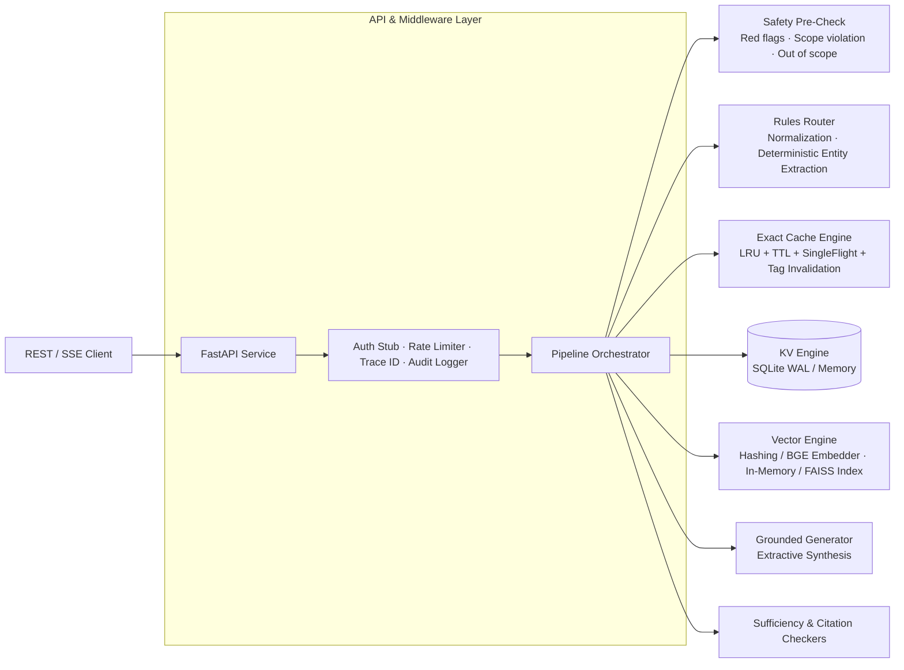
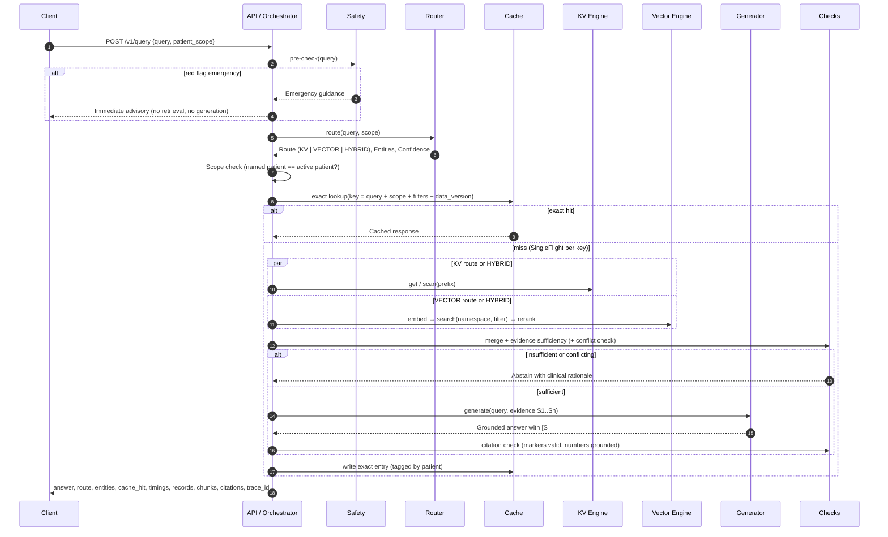

# MedMemory Architecture (Phase 1 Milestone)

> **Educational prototype. Not medical advice. Synthetic and public data only.**

MedMemory answers clinical questions by orchestrating **exact key-value lookups** (patient records, lab results, ICD-10-CM codes, drug identifiers) with **semantic vector search** (clinical notes, drug labels, consumer health summaries).

Our core contribution is the hybrid database and orchestration layer: query routing, patient scoping, exact caching with tag invalidation, multi-engine retrieval, grounded synthesis, and end-to-end stage timing.

---

## High-Level Architecture

---

## Request Lifecycle

Every stage records `{stage, start_ms, duration_ms, status, meta}` for observability and auditability.

---

## Patient Scoping (Defense in Depth)

1. **Request boundary:** Active patient scope is validated before retrieval. If a query references a different patient ID or names multiple patients, execution immediately halts with `scope_violation`.
2. **Key-Value prefix containment:** All patient records live strictly under `patient:{id}:`. The KV repository scans only the in-scope prefix.
3. **Vector namespace isolation:** The `patient_notes` namespace is searched exclusively with an exact metadata filter `{"patient_id": {"$eq": scope}}`. Post-filtering verifies that no out-of-scope chunks survive.
4. **Cache scoping:** Cache keys incorporate patient scope and data versions (`meta:version:{patient}`). Cached entries are tagged with `patient:{id}`, enabling atomic write-through invalidation when new labs or records are added.
5. **Privacy-preserving audit logging:** Audit logs record salted hashes of patient IDs rather than raw patient identifiers.

---

## Module Boundaries & Protocols

| Module | Package | Interface (`contracts/protocols.py`) | Implementation |
|---|---|---|---|
| **KV Engine** | `medmemory.kv` | `KVStore` | `SQLiteKV` (WAL), `MemoryKV` |
| **Vector Engine** | `medmemory.vector` | `Embedder`, `VectorStore`, `Reranker` | `HashingEmbedder`, `InMemoryVectorStore`, `FaissVectorStore`, `LexicalReranker` |
| **Router** | `medmemory.router` | `Router` | `RulesRouter` + `Lexicon` + `extract` |
| **Cache Engine** | `medmemory.cache` | `Cache` | `LRUCache`, `SingleFlight` |
| **Pipeline & API** | `medmemory.pipeline`, `medmemory.api` | Pipeline Orchestrator & FastAPI routes | `Orchestrator`, `create_app` |
| **Safety & Checks** | `medmemory.safety`, `medmemory.generation` | Pre-checks & Grounding | `precheck`, `check_citations`, `ExtractiveChatModel` |

All concrete dependencies are injected via `container.py` (`Container`), enabling isolated unit testing and modular team development.
